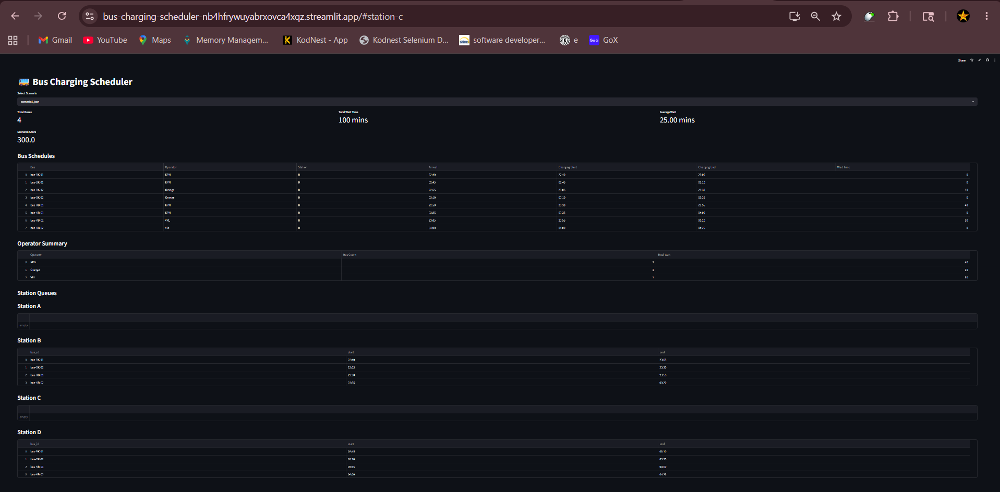
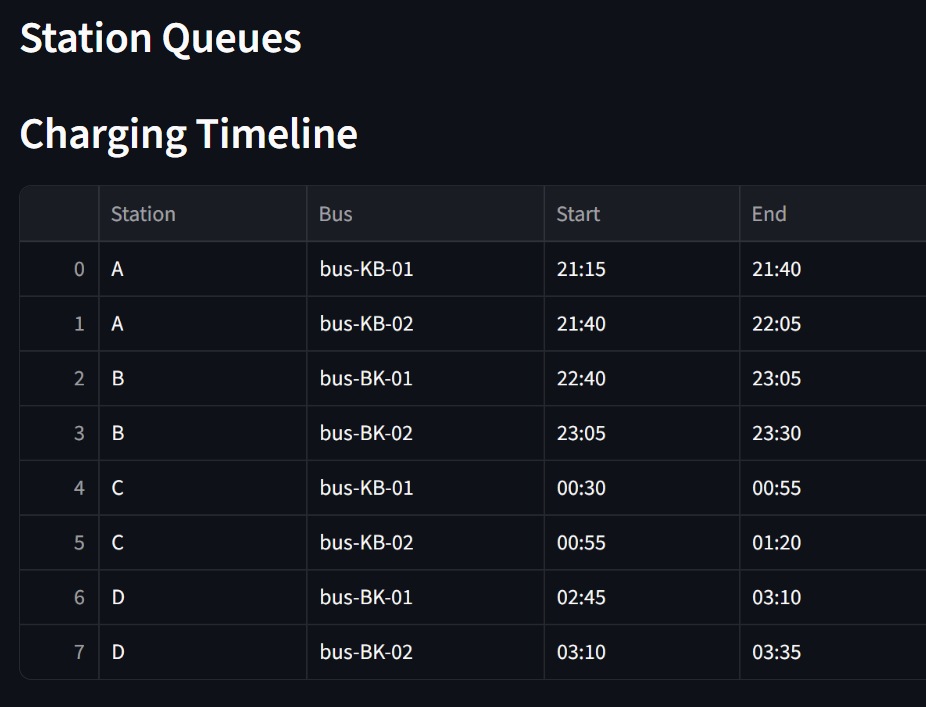
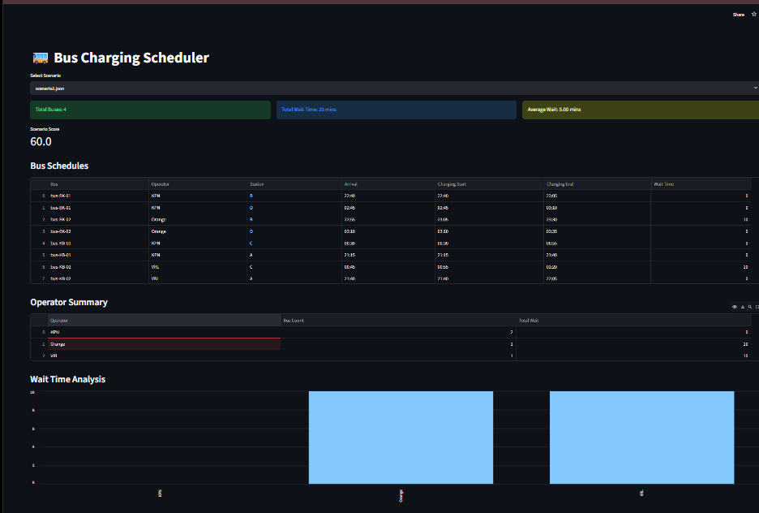
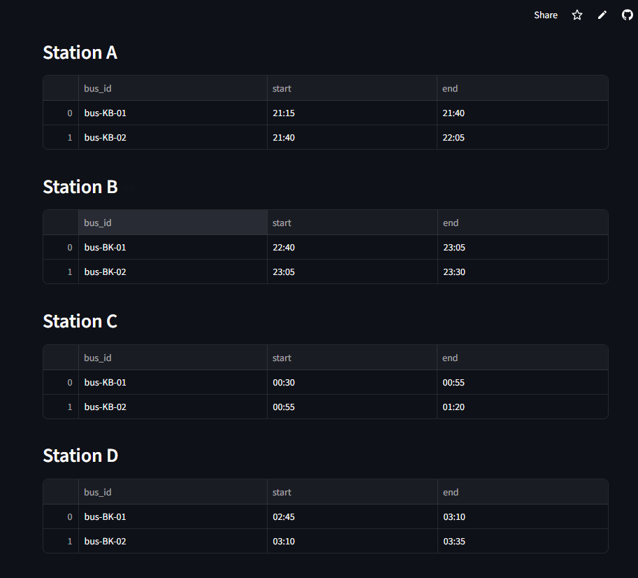

# 🚌 Bus Charging Scheduler

A scalable bus charging scheduling system built using Python and Streamlit.

This project simulates EV bus charging allocation across multiple charging stations between Bengaluru and Kochi while minimizing congestion and wait times.

---

# 🚀 Features

* Dynamic scenario loading using JSON
* Charging station queue management
* Bus scheduling engine
* Wait-time calculation
* Operator-wise analytics
* Scenario scoring system
* Streamlit dashboard UI
* Modular architecture for scalability

---

# 🏗️ Tech Stack

* Python
* Streamlit
* Pandas

---

# 📂 Project Structure

```bash
bus-charging-scheduler/
│
├── app.py
│
├── data/
│   ├── scenario1.json
│   ├── scenario2.json
│   ├── scenario3.json
│   ├── scenario4.json
│   └── scenario5.json
│
├── models/
│   ├── __init__.py
│   ├── bus.py
│   ├── station.py
│   ├── route.py
│   └── schedule.py
│
├── scheduler/
│   ├── __init__.py
│   ├── engine.py
│   ├── scoring.py
│   └── rules.py
│
├── utils/
│   ├── __init__.py
│   ├── scenario_loader.py
│   └── time_utils.py
│
├── README.md
├── ARCHITECTURE.md
└── requirements.txt
```

---

# ⚙️ Setup Instructions

## 1. Clone Repository

```bash
git clone <your-repository-url>
cd bus-charging-scheduler
```

---

## 2. Create Virtual Environment

```bash
python -m venv venv
```

Activate environment:

### Windows

```bash
venv\Scripts\activate
```

---

## 3. Install Dependencies

```bash
pip install -r requirements.txt
```

---

## 4. Run Application

```bash
streamlit run app.py
```

---

# 📊 Scheduler Logic

The scheduler performs the following:

1. Loads route and bus data dynamically from JSON
2. Simulates travel between charging stations
3. Assigns charging slots based on charger availability
4. Calculates waiting time for each bus
5. Maintains charging queues for every station
6. Generates scheduling tables and analytics

---

# 📈 Metrics Displayed

* Total Buses
* Total Wait Time
* Average Wait Time
* Operator-wise Wait Statistics
* Charging Queue Timelines
* Scenario Score

---

# 🧠 Assumptions

* One charger per station
* Charging time is fixed at 25 minutes
* Travel speed is approximated as 1 km = 1 minute
* Buses follow predefined charging stops
* Scenarios are configurable using JSON

---

# 🔮 Future Improvements

* Smarter optimization algorithms
* Dynamic route planning
* Multiple chargers per station
* Real-time traffic integration
* Battery percentage simulation
* Priority scheduling
* Interactive charts and graphs

---

# 📸 Screenshots

Add screenshots of:

* Dashboard
* Bus schedules
* Station queues
* Metrics section

---

# 🌐 Deployment

The project can be deployed using Streamlit Community Cloud.

---

# 👨‍💻 Author

Dhananjay Chougule


## Screenshots

### Dashboard


### Queue Management


### Headline


### Matrix
